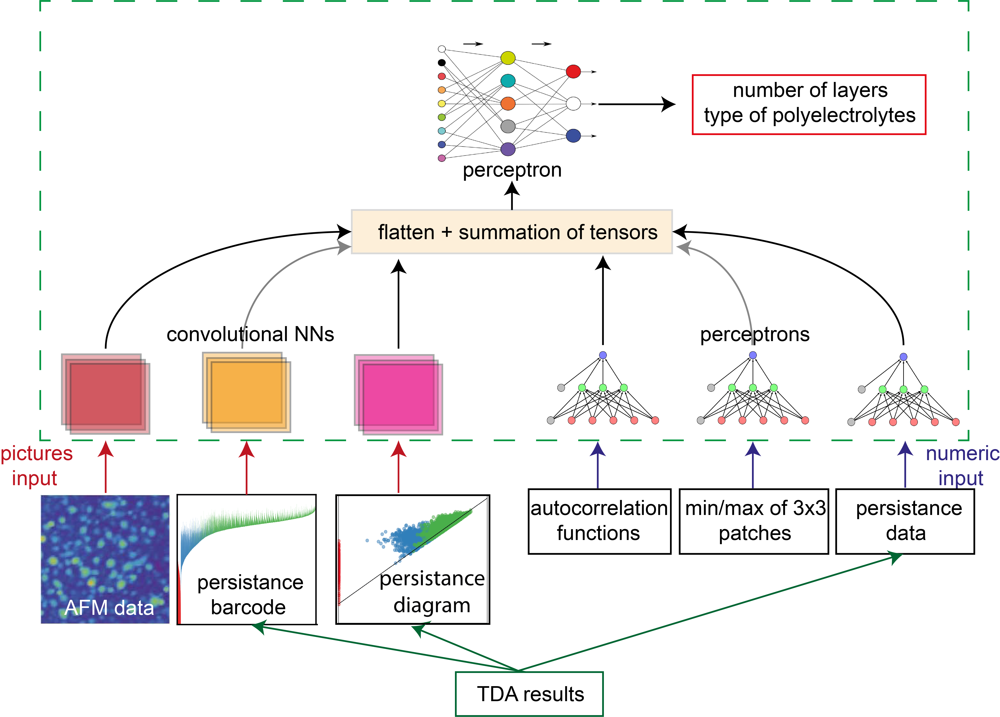
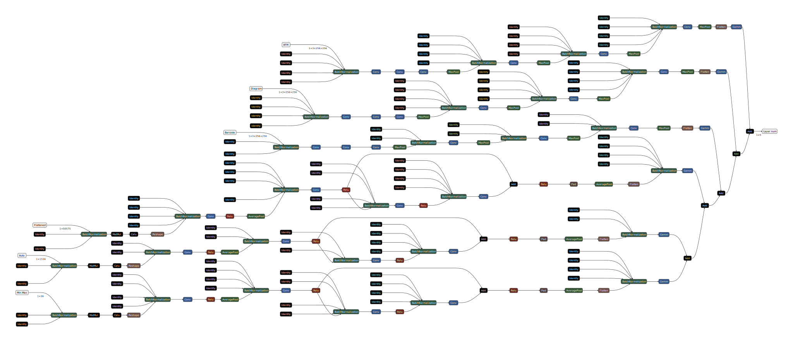

# Project Title


 


# Project Overview

This project created a classification model capable of determining the number of polyelectrolyte bilayers from AFM data. TDA methods were used to increase the quality and quantity of the training set. We used CNN and a perceptron based on the [PyTorch](https://pytorch.org) framework. Optimization was carried out using [Optuna](https://optuna.org).

# Installation and Setup

Clone project
```bash
git clone github.com/ShockOfWave/barcode
```

To install dependencies run
```bash
pip install -r requirements.txt
```

To start data generation and training you can run
```bash
python -m src
```

If you want only generate data run

```bash
python -m src.data.make_dataset
```

If you want to only train model run

```bash
python -m src.train.train_model
```

if you want to optimize model run

```bash
python -m src.train.tune_model_optuna
```

# Data

Data were collected using atomic force microscopes. Additional data was obtained using TDA analysis, as well as the code provided in our previous [repository](https://github.com/ShockOfWave/barcode).

# Results and evaluation

### Model structure



We used 3 input convolutional heads for images and 3 input heads based on the perceptron model, after which we combined them into one perceptron with an activation function for our task.

# Future work
Further potential work is associated with the use of neural networks for real-time analysis of images from an atomic force microscope.

# Acknowledgments/References
We thank the [Infochemistry Scientific Center ISC](infochemistry.ru) for the provided data and computing power.

# License
The code is distributed under the [MIT license](https://opensource.org/license/mit/).